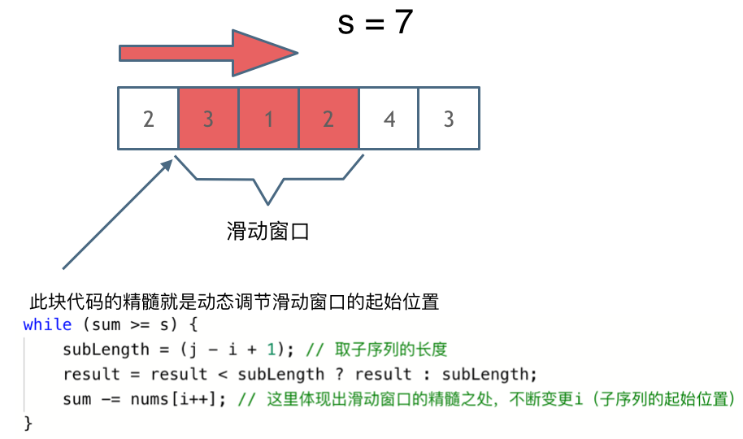

# 209 长度最小的子数组 59 螺旋矩阵2 区间和

## 长度最小的子数组

**滑动窗口**

给定一个含有 n 个正整数的数组和一个正整数 target 。

找出该数组中满足其总和大于等于 target 的长度最小的 子数组 [numsl, numsl+1, ..., numsr-1, numsr] ，并返回其长度。如果不存在符合条件的子数组，返回 0 。

示例 1：

输入：target = 7, nums = [2,3,1,2,4,3]
输出：2
解释：子数组 [4,3] 是该条件下的长度最小的子数组。
示例 2：

输入：target = 4, nums = [1,4,4]
输出：1
示例 3：

输入：target = 11, nums = [1,1,1,1,1,1,1,1]
输出：0

### 暴力解法

两个for循环

i 代表开始元素位置 从0到size - 1

j 从i开始，到size - 1

subSum一个一个加上nums[j] 大于给定值时，比较跟当前最短长度哪个小，如果小就更新最短长度

### 滑动窗口

j 从0到size - 1，是窗口头指针

i 从0开始，是窗口尾指针

j 每次前进一格，当前窗口总和加上nums[j]

如果sum大于target，则当前窗口内子串符合要求，如果字串长度比已发现的最短子串还短，则最短字串更新为当前子串。

尝试去掉尾指针元素，尾指针向前移动一位(i++)，重复比较sum和target，如果sum大于target，则当前窗口内子串符合要求，如果字串长度比已发现的最短子串还短，则最短字串更新为当前子串。循环这个步骤，每次去掉一个尾部，直到sum比target小为止。




```c#
public class Solution {
    public int MinSubArrayLen(int target, int[] nums) {
        int shortestLength = int.MaxValue;
        int sum = 0;

        for (int i = 0, j = 0; j < nums.Length; j++)
        {
            sum += nums[j];

            while (sum >= target)
            {
                int subLength = (j - i + 1);
                shortestLength = shortestLength > subLength ? subLength : shortestLength;
                sum -= nums[i];
                i++;
            }
        }

        if (shortestLength < int.MaxValue)
            return shortestLength;
        else
            return 0;
    }
}
```

## 螺旋矩阵2

给你一个正整数 n ，生成一个包含 1 到 n2 所有元素，且元素按顺时针顺序螺旋排列的 n x n 正方形矩阵 matrix 。


输入：n = 3
输出：[[1,2,3],[8,9,4],[7,6,5]]
示例 2：

输入：n = 1
输出：[[1]]


```c#
public class Solution {
    public int[][] GenerateMatrix(int n) {
        int[][] result = new int[n][];

        for (int k = 0; k < n; k++)
            result[k] = new int[n];

        int x = 0;
        int y = 0;
        int mid = n / 2;
        int offset = 1;
        int loop = n / 2;
        int i = 0;
        int j = 0;
        int count = 1;

        while (loop > 0)
        {
            i = x;
            j = y;

            for (; j < n - offset; j++)
                result[i][j] = count++;

            for (; i < n - offset; i++)
                result[i][j] = count++;

            for (;j > y ;j--)
                result[i][j] = count++;
            
            for (; i > x; i--)
                result[i][j] = count++;
            
            x++;
            y++;
            loop--;
            offset++;
        }

        if (n % 2 == 1)
            result[mid][mid] = n * n;
        
        return result;

    }
}
```