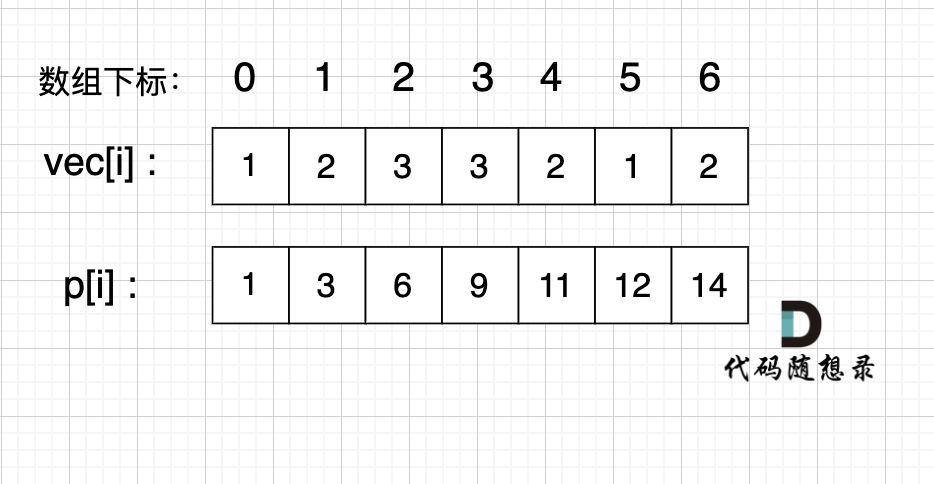

# 209 长度最小的子数组 59 螺旋矩阵2 区间和

## 长度最小的子数组

**滑动窗口**

给定一个含有 n 个正整数的数组和一个正整数 target 。

找出该数组中满足其总和大于等于 target 的长度最小的 子数组 [numsl, numsl+1, ..., numsr-1, numsr] ，并返回其长度。如果不存在符合条件的子数组，返回 0 。

示例 1：

输入：target = 7, nums = [2,3,1,2,4,3]
输出：2
解释：子数组 [4,3] 是该条件下的长度最小的子数组。
示例 2：

输入：target = 4, nums = [1,4,4]
输出：1
示例 3：

输入：target = 11, nums = [1,1,1,1,1,1,1,1]
输出：0

### 暴力解法

两个for循环

i 代表开始元素位置 从0到size - 1

j 从i开始，到size - 1

subSum一个一个加上nums[j] 大于给定值时，比较跟当前最短长度哪个小，如果小就更新最短长度

### 滑动窗口

j 从0到size - 1，是窗口头指针

i 从0开始，是窗口尾指针

j 每次前进一格，当前窗口总和加上nums[j]

如果sum大于target，则当前窗口内子串符合要求，如果字串长度比已发现的最短子串还短，则最短字串更新为当前子串。

尝试去掉尾指针元素，尾指针向前移动一位(i++)，重复比较sum和target，如果sum大于target，则当前窗口内子串符合要求，如果字串长度比已发现的最短子串还短，则最短字串更新为当前子串。循环这个步骤，每次去掉一个尾部，直到sum比target小为止。


```c#
public class Solution {
    public int MinSubArrayLen(int target, int[] nums) {
        int shortestLength = int.MaxValue;
        int sum = 0;

        for (int i = 0, j = 0; j < nums.Length; j++)
        {
            sum += nums[j];

            while (sum >= target)
            {
                int subLength = (j - i + 1);
                shortestLength = shortestLength > subLength ? subLength : shortestLength;
                sum -= nums[i];
                i++;
            }
        }

        if (shortestLength < int.MaxValue)
            return shortestLength;
        else
            return 0;
    }
}
```

## 螺旋矩阵2

给你一个正整数 n ，生成一个包含 1 到 n2 所有元素，且元素按顺时针顺序螺旋排列的 n x n 正方形矩阵 matrix 。


输入：n = 3
输出：[[1,2,3],[8,9,4],[7,6,5]]
示例 2：

输入：n = 1
输出：[[1]]


```c#
public class Solution {
    public int[][] GenerateMatrix(int n) {
        int[][] result = new int[n][];

        for (int k = 0; k < n; k++)
            result[k] = new int[n];

        int x = 0;
        int y = 0;
        int mid = n / 2;
        int offset = 1;
        int loop = n / 2;
        int i = 0;
        int j = 0;
        int count = 1;

        while (loop > 0)
        {
            i = x;
            j = y;

            for (; j < n - offset; j++)
                result[i][j] = count++;

            for (; i < n - offset; i++)
                result[i][j] = count++;

            for (;j > y ;j--)
                result[i][j] = count++;
            
            for (; i > x; i--)
                result[i][j] = count++;
            
            x++;
            y++;
            loop--;
            offset++;
        }

        if (n % 2 == 1)
            result[mid][mid] = n * n;
        
        return result;

    }
}
```

## 区间和

题目描述
给定一个整数数组 Array，请计算该数组在每个指定区间内元素的总和。
输入描述
第一行输入为整数数组 Array 的长度 n，接下来 n 行，每行一个整数，表示数组的元素。随后的输入为需要计算总和的区间下标：a，b （b > = a），直至文件结束。
输出描述
输出每个指定区间内元素的总和。
输入示例
5
1
2
3
4
5
0 1
1 3
输出示例
3
9
提示信息
数据范围：
0 < n <= 100000



[a, b] => p[b] - p [a - 1]

if a == 0 then return p[b]

```c++
#include <iostream>
#include <vector>
using namespace std;
 
int main()
{
    int n, a, b;
    cin >> n;
    vector<int> vec(n);
    vector<int> p(n);
    int sum = 0;
    for (int i = 0; i < n; i++)
    {
        cin >> vec[i];
        sum += vec[i];
        p[i] = sum;
    }
     
    sum = 0;
    while (cin >> a >> b)
    {
        if (a == 0)
            sum = p[b];
        else
            sum = p[b] - p[a - 1];
        std::cout << sum << std::endl;
    }
}
```

## 开发商划分土地

在一个城市区域内，被划分成了n * m个连续的区块，每个区块都拥有不同的权值，代表着其土地价值。目前，有两家开发公司，A 公司和 B 公司，希望购买这个城市区域的土地。 

现在，需要将这个城市区域的所有区块分配给 A 公司和 B 公司。

然而，由于城市规划的限制，只允许将区域按横向或纵向划分成两个子区域，而且每个子区域都必须包含一个或多个区块。 为了确保公平竞争，你需要找到一种分配方式，使得 A 公司和 B 公司各自的子区域内的土地总价值之差最小。 

注意：区块不可再分

输入描述
第一行输入两个正整数，代表 n 和 m。 

接下来的 n 行，每行输出 m 个正整数。

输出描述
请输出一个整数，代表两个子区域内土地总价值之间的最小差距。
输入示例

3 3

1 2 3

2 1 3

1 2 3

输出示例
0
提示信息
如果将区域按照如下方式划分：

1 2 | 3

2 1 | 3

1 2 | 3 

两个子区域内土地总价值之间的最小差距可以达到 0。

关键在于求出每一行的和还有每一列的和，这样就可以计算行与列的前缀和。

```c++
#include <iostream>
#include <vector>
#include <climits>

using namespace std;

int main()
{
    int n, m;
    cin >> n >> m;
    
    vector<vector<int>> vec(n, vector<int>(m, 0));
    int sum = 0;
    
    for (int i = 0; i < n; i++)
        for (int j = 0; j < m; j++)
        {
            cin >> vec[i][j];
            sum += vec[i][j];
        }
        
    vector<int> horizontal(n, 0);
    vector<int> vertical(m, 0);
    
    for (int i = 0; i < n; i++)
        for (int j = 0; j < m; j++)
            horizontal[i] += vec[i][j];
            
    for (int i = 0; i < n; i++)
        for (int j = 0; j < m; j++)
            vertical[j] += vec[i][j];
    
    int result = INT_MAX;
    int horizontalSum = 0;
    int verticalSum = 0;
    
    for (int i = 0; i < n; i++)
    {
        horizontalSum += horizontal[i];
        result = min(result, abs(sum - horizontalSum - horizontalSum));
    }
    
    for (int j = 0; j < m; j++)
    {
        verticalSum += vertical[j];
        result = min(result, abs(sum - verticalSum - verticalSum));
    }
    
    std::cout << result << std::endl;
}
```

或者在遍历全组时，累加所有遍历过的值，在行尾和列尾计算一次差值。
